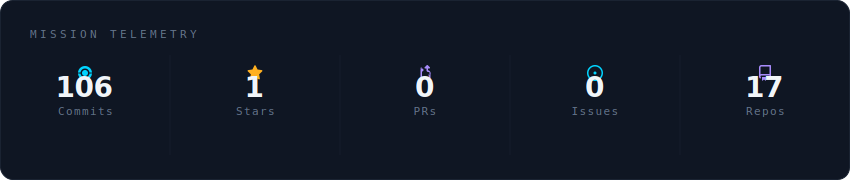

  

 

  

 

  

 

  

 

<strong>Mais Sobre Mim</strong>

 

<strong>Mais sobre mim</strong>

 

Sou estudante de **Análise e Desenvolvimento de Sistemas (ADS)** e desenvolvedor em formação, apaixonado por tecnologia e por criar soluções que resolvam problemas reais.

Tenho experiência com **Python, desenvolvimento backend, APIs e bancos de dados**, além de conhecimentos em **suporte técnico, configuração de sistemas e redes básicas**.

Atualmente estou focado em aprofundar meus conhecimentos em **Python, FastAPI e desenvolvimento web**, construindo projetos práticos para evoluir minhas habilidades tanto no **backend quanto no frontend**.

Meu objetivo é crescer como desenvolvedor, participar de projetos relevantes e contribuir cada vez mais com a comunidade de tecnologia.

**Atualmente estudando** — Análise e Desenvolvimento de Sistemas (ADS)

**Currently at**  Rio de Janeiro, Brasil

 

  
  

